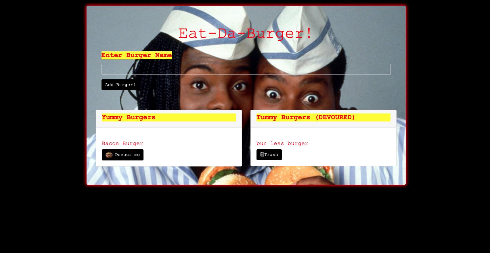

# Burger

## Description

Eat-Da-Burger! is a restaurant app that lets users input the names of burgers they'd like to eat.

Whenever a user submits a burger's name, your app will display the burger on the left side of the page -- waiting to be devoured.

Each burger in the waiting area also has a Devour it! button. When the user clicks it, the burger will move to the right side of the page.

## User Story
AS A USER I want to enter my burger name
THEN Devour or Trash the Burger

## App Screenshot

# Video Demo Link

https://www.screencast.com/t/XoABgSO3

